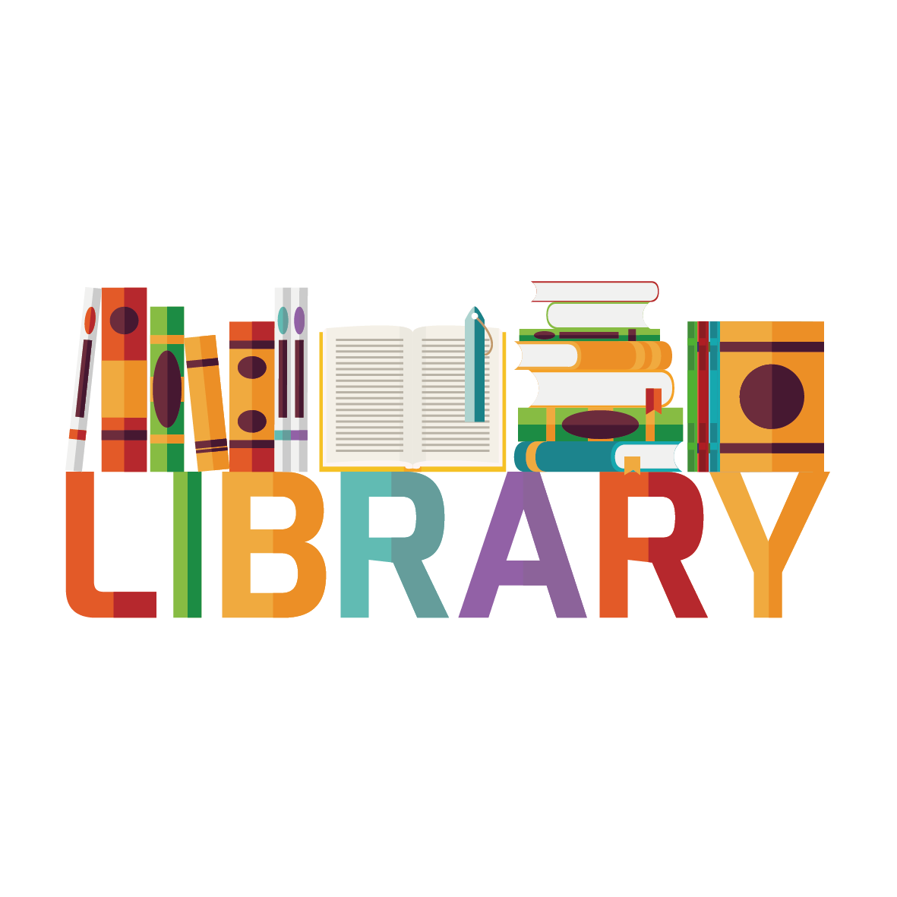

<a name="readme-top"></a>

<div align="center">
    
    <h1><b>OOP School Library</b></h1>
</div>

---

<!-- TABLE OF CONTENTS -->

# 📗 Table of Contents

- [📗 Table of Contents](#-table-of-contents)
- [📖 OOP School Library ](#-oop-school-library-) - [Learning objectives](#learning-objectives)
  - [🛠 Built With ](#-built-with-)
    - [Tech Stack ](#tech-stack-)
    - [Key Features ](#key-features-)
  - [💻 Getting Started ](#-getting-started-)
    - [Prerequisites](#prerequisites)
    - [Setup](#setup)
  - [👥 Authors ](#-authors-)
  - [🔭 Future Features ](#-future-features-)
  - [🤝 Contributing ](#-contributing-)
  - [⭐️ Show your support ](#️-show-your-support-)
  - [🙏 Acknowledgments ](#-acknowledgments-)
  - [📝 License ](#-license-)

---

<!-- PROJECT DESCRIPTION -->

# 📖 OOP School Library <a name="about-project"></a>

- This project is part of the Microverse Ruby curriculum. The goal is to create a library system using Ruby and OOP principles.

#### Learning objectives

- Understand the basics of OOP.
- Implement classes and objects in Ruby.
- Implement encapsulation and inheritance with Ruby.
- Run a program using the command line.

## 🛠 Built With <a name="built-with"></a>

### Tech Stack <a name="tech-stack"></a>

  <ul>
    <li>
      <a href="https://www.ruby-lang.org/en/">
        
      </a>
    </li>
  </ul>

---

<!-- Features -->

### Key Features <a name="key-features"></a>

- **[Setup environment according to Microverse guidelines]**
- **[Follow Ruby best practices]**
- **[Implementation of OOP concepts]**

<p align="right">(<a href="#readme-top">back to top</a>)</p>

<!-- GETTING STARTED -->

## 💻 Getting Started <a name="getting-started"></a>

To get a local copy up and running, follow these steps.

### Prerequisites

In order to run this project you need:

- To install Ruby, follow the instructions on the [official page](https://www.ruby-lang.org/en/documentation/installation/).

### Setup

Clone this repository to your desired folder:

Example commands:

- With SSH:

```bash
  cd my-folder
  git clone git@github.com:mwismann/oop_school_library.git
```

- With HTTPS:

```bash
  cd my-folder
  git clone hhttps://github.com/mwismann/oop_school_library.git
```

- With GitHub CLI:

```bash
  cd my-folder
  gh repo clone mwismann/OOP_school_library
```

<p align="right">(<a href="#readme-top">back to top</a>)</p>

---

<!-- AUTHORS -->

## 👥 Authors <a name="authors"></a>

👤 **Mathias Wismann**

- GitHub: [@mwismann](https://github.com/mwismann)
- Twitter: [@mathias_wismann](https://twitter.com/mathias_wismann)
- LinkedIn: [Mathias Wismann](https://www.linkedin.com/in/mathias-wismann/)

<p align="right">(<a href="#readme-top">back to top</a>)</p>

---

<!-- FUTURE FEATURES -->

## 🔭 Future Features <a name="future-features"></a>

- [ ] Class Decorators.
- [ ] Associations.
- [ ] Basic UI.
- [ ] Tests.

<p align="right">(<a href="#readme-top">back to top</a>)</p>

---

<!-- CONTRIBUTING -->

## 🤝 Contributing <a name="contributing"></a>

Contributions, issues, and feature requests are welcome!

Feel free to check the [issues page](https://github.com/mwismann/oop_school_library/issues).

<p align="right">(<a href="#readme-top">back to top</a>)</p>

---

<!-- SUPPORT -->

## ⭐️ Show your support <a name="support"></a>

Give a ⭐ if you liked this project!

<p align="right">(<a href="#readme-top">back to top</a>)</p>

---

<!-- ACKNOWLEDGEMENTS -->

## 🙏 Acknowledgments <a name="acknowledgements"></a>

I thank the Code Reviewers for their advice and time 🏆

<p align="right">(<a href="#readme-top">back to top</a>)</p>

---

<!-- LICENSE -->

## 📝 License <a name="license"></a>

This project is [MIT](./LICENSE) licensed.

<p align="right">(<a href="#readme-top">back to top</a>)</p>

---
